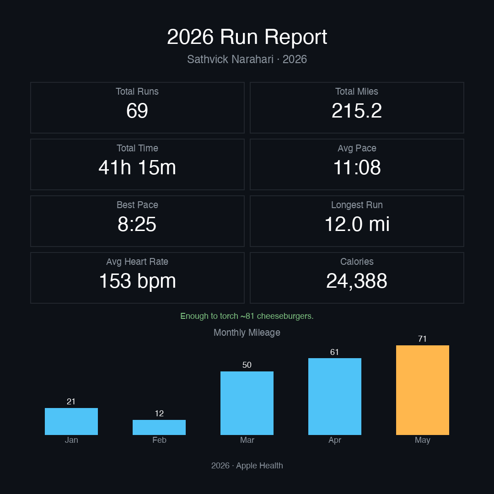
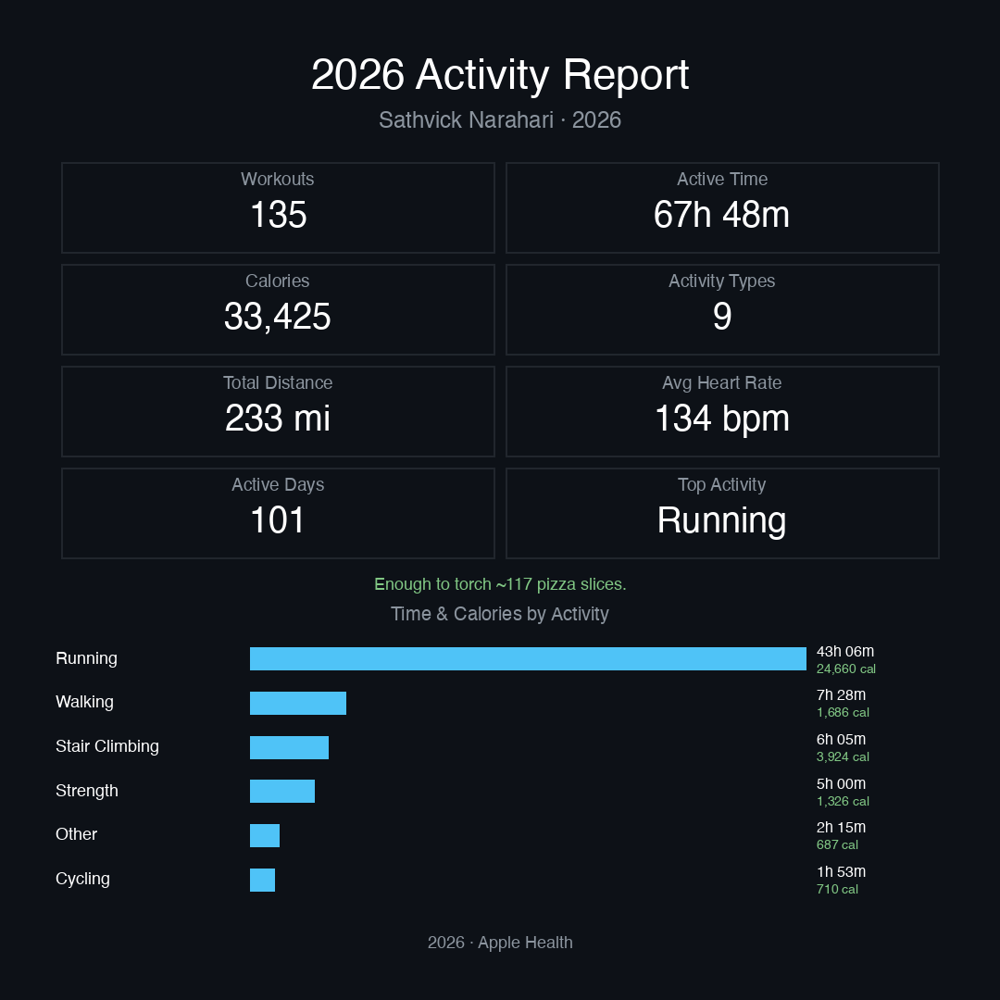
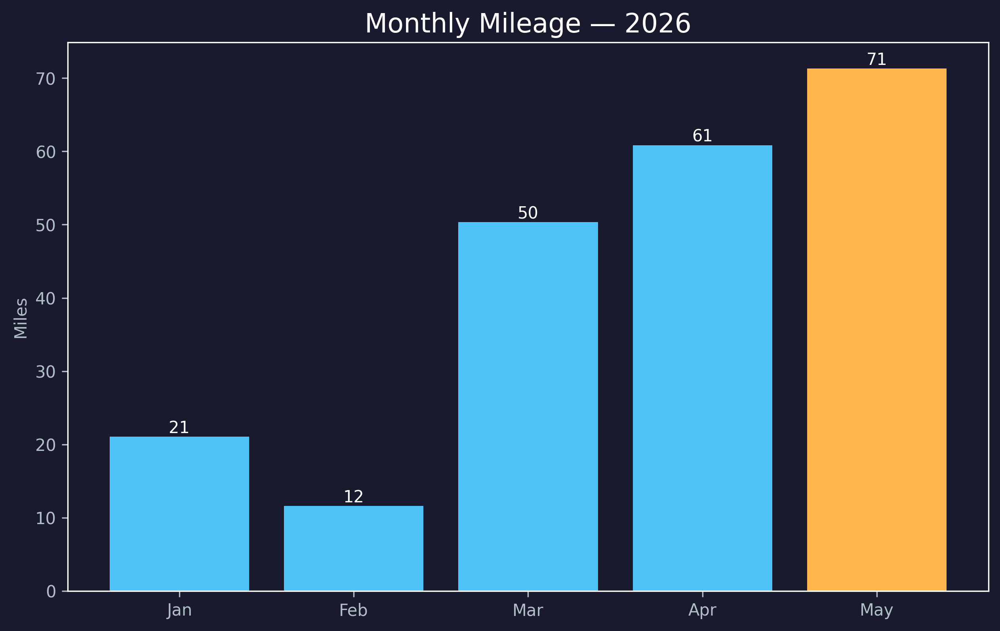
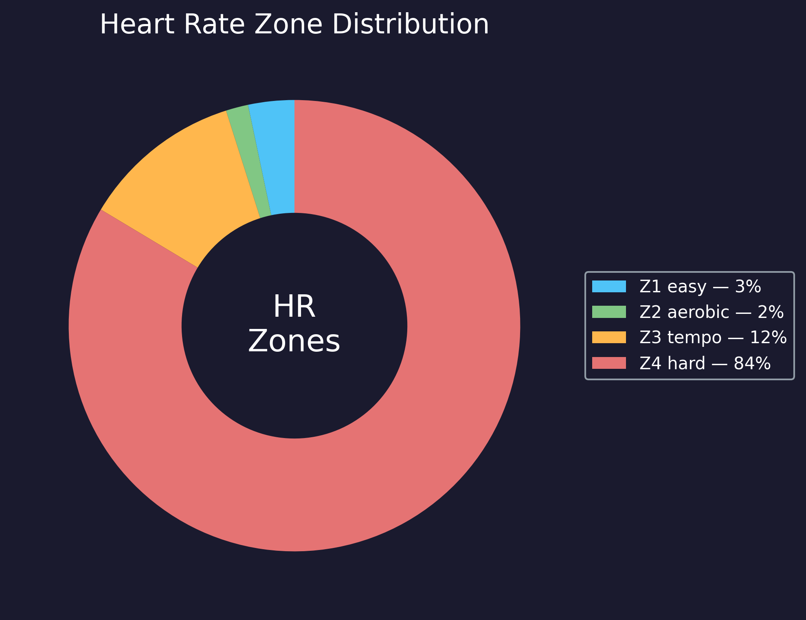

# Apple Health Report 🏃

I wanted a Spotify-Wrapped-style recap of my training, but for Apple Health —
so I built one. It turns your Health export into clean stat cards for your
**runs** and for **every workout type** (walks, cycling, strength, ...), plus
charts and text reports. Everything runs **locally** on your machine — none of
your health data ever leaves your computer.

> The `output/` folder and any health export are git-ignored. Your data is
> never committed.

> **The bug that fooled me at first:** I track every run in three apps at once
> (Apple Watch, Strava, Runna), so each one got counted three times. My "546
> miles" was really 215. Catching that — and fixing it with
> [start-time de-duplication](#how-dedup-works) — turned out to be the most
> interesting part of the project.

---

## What it looks like

| Run Report | Activity Report |
|:---:|:---:|
|  |  |

And the standalone charts (`run.py`):

| Monthly mileage | Heart-rate zones |
|:---:|:---:|
|  |  |

> The numbers above are my own 2026 data — aggregate totals (miles, pace,
> average HR, calories), not raw health records. They're the sample output, so
> you can see exactly what you'll get.

---

## What you get

Two commands, two cards:

- **`python run.py`** → a **Run Report** (running only)
- **`python activity.py`** → an **Activity Report** (every workout type: runs,
  walks, cycling, strength, stair climbing, hiking, ...)

Output into `output/`:

| File | From | What |
|------|------|------|
| `run_report_card.png` | `run.py` | Run Report card: 8 stat tiles + monthly bar chart |
| `monthly_mileage.png` | `run.py` | Bar chart of miles per month |
| `hr_zones.png` | `run.py` | Heart-rate zone distribution (pie) |
| `stats.txt` | `run.py` | Plain-text running summary |
| `activity_report_card.png` | `activity.py` | Activity Report card: tiles + time-and-calories-by-activity bars |
| `activity_stats.txt` | `activity.py` | Plain-text all-activity summary |
| `ai_analysis.md` | `run.py --ai-analysis` | Local-LLM coaching analysis of your stats (optional) |
| `marathon_prep.txt` | `marathon_prep.py` | YTD vs. training-block comparison |

Stats are **de-duplicated**: if you log the same workout in multiple apps
(Apple Watch + Strava + Runna), it's counted once. See
[How dedup works](#how-dedup-works).

---

## Setup

Requires **Python 3.10+**.

```bash
git clone https://github.com/SathvickN/health-wrapped.git
cd health-wrapped

python3 -m venv venv
source venv/bin/activate          # Windows: venv\Scripts\activate
pip install -r requirements.txt
```

---

## Export your Apple Health data

1. On iPhone, open **Health** app.
2. Tap your **profile picture** (top right).
3. Scroll down → **Export All Health Data**.
4. Wait for the `export.zip` to generate (can take a few minutes).
5. AirDrop / email it to your Mac and drop it in this project folder.

The zip contains `apple_health_export/export.xml`. The tool reads the zip
directly — no need to unzip.

---

## Run it

**Running insights:**

```bash
python run.py --zip export.zip --year 2026 --name "Your Name"
```

**All-activity insights** (same flags):

```bash
python activity.py --zip export.zip --year 2026 --name "Your Name"
```

Parsing the whole export can take a minute or two on large exports.

### Options

| Flag | Default | Description |
|------|---------|-------------|
| `--zip` | `apple_health_export.zip` | Path to your Health export zip |
| `--year` | `2026` | Year to analyze |
| `--name` | `Your Name` | Name shown on the card |
| `--age` | none | Used for HR-zone max-HR (`220 − age`); default max 185 |
| `--stats-only` | off | Print/save text stats only, skip images |
| `--ai-summary` | off | Add a short AI-generated running quote to the card (needs local Ollama, see below) |
| `--ai-analysis` | off | Write a local-LLM coaching analysis of your stats to `output/ai_analysis.md` |

---

## Training-block report (optional)

Compare your full year against a training block (e.g. marathon prep from a
start date), including **total steps** pulled from the export:

```bash
python marathon_prep.py --zip export.zip --year 2026 --start 2026-03-05
```

Writes `output/marathon_prep.txt`.

---

## Optional: on-device AI

Two optional AI features, both powered by a **fully open-source, locally-run**
model — **Meta Llama 3.2 3B Instruct** (open weights, Llama-community license),
**downloaded from the
[Hugging Face Hub](https://huggingface.co/bartowski/Llama-3.2-3B-Instruct-GGUF)**.
No API key, no cloud — the weights come from Hugging Face and inference runs
on-device.

- **`--ai-summary`** — a short running quote printed on the card. The prompt is
  generic ("write a running quote"); it contains none of your data.
- **`--ai-analysis`** — a personalized coaching write-up saved to
  `output/ai_analysis.md`: overview, what's going well, what to work on, and a
  suggested next goal — all grounded in your real numbers. Your stats are sent
  **only to the local model on your machine**, never to any server.

Everything else (parsing, stats, charts, cards) uses **no AI** — just plain
Python. If the model can't run, both features skip silently and the rest still
generates.

**How it works:** on first use, `ai_summary.py` calls
`huggingface_hub.hf_hub_download` to fetch the GGUF weights
(`bartowski/Llama-3.2-3B-Instruct-GGUF`, Q4_K_M, ~2 GB) from Hugging Face, then
registers them once with the local [Ollama](https://ollama.com) engine
(`ollama create llama32-hf`) and runs inference locally.

```bash
# one-time: install the Ollama engine (https://ollama.com/download)
python run.py --zip export.zip --year 2026 --ai-summary
# first run downloads ~2 GB from Hugging Face, then caches it
```

**Use any public Hugging Face model.** `huggingface_hub` is in
`requirements.txt`. Point it at any other **public GGUF** repo on the Hub by
editing `HF_REPO` / `HF_FILE` at the top of `ai_summary.py` — e.g.
`bartowski/Qwen2.5-3B-Instruct-GGUF`, `bartowski/Mistral-7B-Instruct-v0.3-GGUF`,
`TheBloke/Llama-2-7B-Chat-GGUF`. Pick a `*-GGUF` repo and a quant filename
(e.g. `...Q4_K_M.gguf`); no token needed for public/ungated repos.

> The official `meta-llama/Llama-3.2-3B` repo on Hugging Face is **gated**
> (needs an account + access token). This project uses the ungated
> `bartowski` GGUF mirror, so no token is required.

---

## How dedup works

The same physical workout is often recorded by several apps/devices with
near-identical start times. `parse_health.py` clusters workouts whose start
times fall within **15 minutes** and keeps one per cluster.

It picks the **most complete record** in each cluster — the row with the most of
{distance, heart rate, calories} present. This is **not a hardcoded source
list**, so it works with any device: Apple Watch, Garmin, Whoop, Fitbit, Coros,
Strava, Runna, etc. Source name is only a *tiebreak* when two records are
equally complete (wearables edge out phone apps). Any missing field on the
chosen row falls back to the first source in the cluster that has it — so an
Apple Watch heart rate is kept even if a phone-app row is otherwise picked.

Tune it in `parse_health.py`: `DEDUP_WINDOW_MIN` (time window) and the
`_WEARABLE_HINTS` / `_APP_HINTS` lists used by `_source_rank` for tiebreaks.

---

## Project layout

```
run.py            # entry point: running insights → Run Report card
activity.py       # entry point: all-activity insights → Activity Report card
parse_health.py   # stream export.xml → clean, de-duplicated workout DataFrames
compute_stats.py  # aggregate workouts into stats dicts (run + activity)
visualize.py      # matplotlib charts (PNG)
generate_card.py  # Pillow Run Report card
ai_summary.py     # optional on-device AI: running quote + coaching analysis (Llama 3.2)
marathon_prep.py  # training-block vs YTD report + step totals
```

---

## Privacy

- All processing is local. Your health data is **never** uploaded anywhere.
- The only network activity is optional: with `--ai-summary` / `--ai-analysis`,
  the model weights are **downloaded from** Hugging Face to your machine, then
  inference runs against a local Ollama instance (`localhost`). Your stats are
  only ever sent to that **local** model — never to any server. (`--ai-summary`
  doesn't even include your stats; `--ai-analysis` does, but stays on-device.)
- `.gitignore` excludes the health artifacts by name (`export.zip`,
  `apple_health_export/`, `export.xml`) and the whole `output/` folder — but if
  you rename your export, **double-check it never gets committed.** That zip is
  your full health history.

---

## License

[MIT](LICENSE) © 2026 Sathvick Narahari
